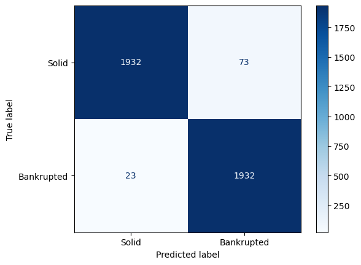
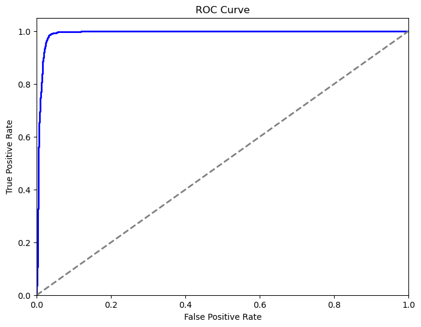

# Model Card

## Model Description

**Input:** The input features for the model are financial ratios and other financial metrics of companies. These include various balance sheet and income statement items that reflect the financial health of the companies.

**Output:** The output of the model is a binary classification indicating whether a company is bankrupt (1) or not bankrupt (0).

**Model Architecture:**

The Neural Network used in this model is a Multi-layer Perceptron (MLP) with the following architecture:
- Hidden layers: Three hidden layers each with 100 neurons.
- Activation function: ReLU activation function.
- Learning rate: 0.01.
- Max iterations: 1000.
- Regularization (alpha): 0.001.
- Solver: Adam optimizer for weight optimization.

Those parameters have been chosen after performing fine-tuning with a random search of 20 iterations on a parameter grid.

## Performance

Evaluation Metrics:

- Accuracy: Measures the proportion of correctly classified instances out of the total instances.
- Precision: Proportion of true positive predictions among all positive predictions.
- Sensitivity (Recall): Proportion of actual positives that are correctly identified by the prediction.
- Specificity: Proportion of actual negatives that are correctly identified by the prediction.
- F1 Score: Harmonic mean of precision and recall, providing a single metric that balances both precision and recall.

Performance on Test Data:

- Accuracy: 0.9758 (97.58% of the data points were correctly classified)
- Precision: 0.9428 (94.28% of predicted bankrupt companies were actually bankrupt)
- Sensitivity (Recall): 0.9882 (98.82% of actual bankrupt companies were correctly identified)
- Specificity: 0.9635 (96.35% of actual non-bankrupt companies were correctly identified)
- F1 Score: 0.95

Confusion Matrix:

- True Positive (TP): 1932
- False Positive (FP): 73
- True Negative (TN): 1932
- False Negative (FN): 23

Roc Curve: 

The area under the ROC curve (AUC) was 0.98, indicating a high level of discrimination between the bankrupt and non-bankrupt companies.

## Limitations

- Data Imbalance: Despite using SMOTE for oversampling the minority class, the real-world data might still be imbalanced. The model may need further fine-tuning to handle imbalanced data effectively.
- Generalization: The model is trained on data from Taiwan Economic Journal for the years 1999–2009. It may not generalize well to companies from different regions or time periods without additional training and validation.
- Feature Dependence: The model relies heavily on the financial metrics provided. Any significant changes in accounting standards or financial reporting practices may affect the model’s performance.

## Trade-offs

- Complexity vs. Interpretability: While the neural network provides high accuracy and performance, it is less interpretable compared to simpler models like logistic regression or decision trees. Understanding the decision-making process of the neural network can be challenging.
- Computation Time: Training the neural network, especially with hyperparameter tuning, is computationally intensive and time-consuming compared to simpler models.
- Overfitting: With a large number of parameters, there is a risk of overfitting the training data. Regularization and cross-validation were used to mitigate this, but there remains a potential trade-off between model complexity and overfitting.